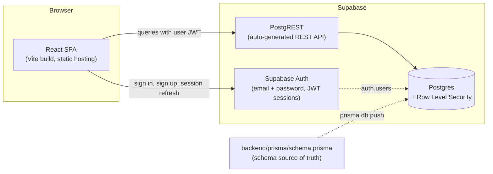
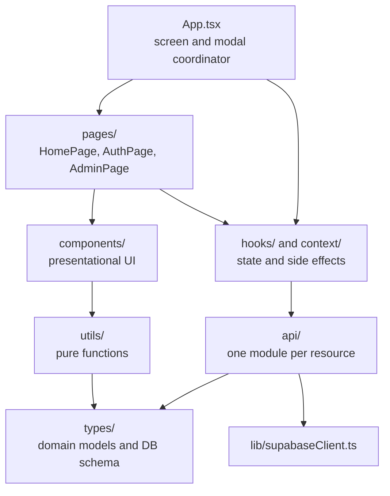
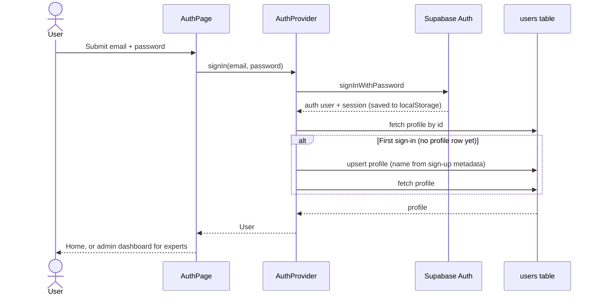
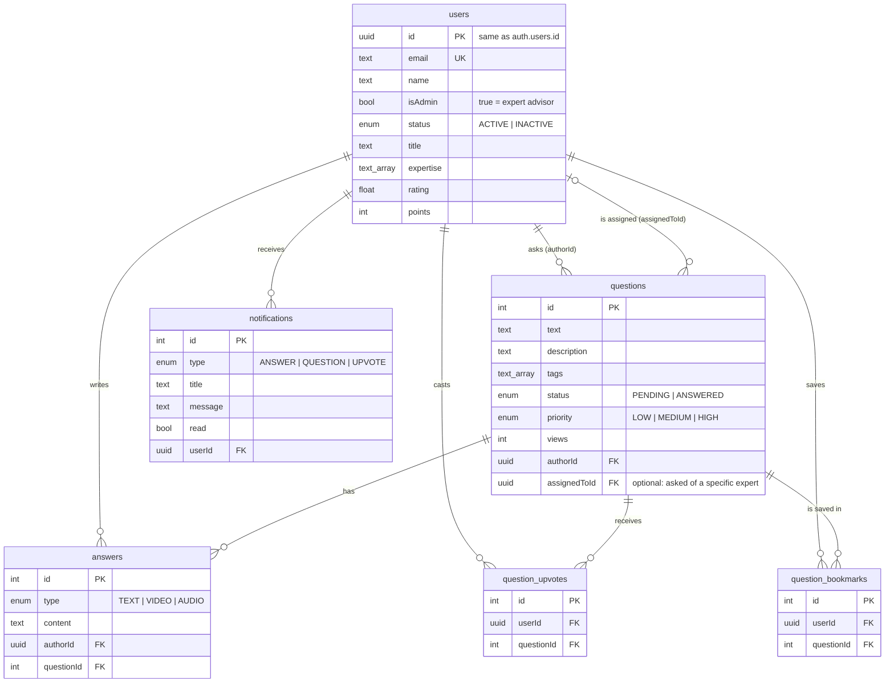

# Playbook: High-Level Design

Playbook is a question-and-answer knowledge base for sales and business leaders. Members ask
questions about topics such as recruiting, objection handling, and team management, and
verified expert advisors answer them. Over time the answered questions become a searchable
library.

This document describes how the app is put together: the overall architecture, how the
frontend is organized, the data model, and the main trade-offs and planned improvements.

## Contents

1. [Users and features](#1-users-and-features)
2. [System architecture](#2-system-architecture)
3. [Frontend architecture](#3-frontend-architecture)
4. [State management](#4-state-management)
5. [Authentication](#5-authentication)
6. [Data model](#6-data-model)
7. [Data access](#7-data-access)
8. [Security model](#8-security-model)
9. [Error handling, accessibility, and UX states](#9-error-handling-accessibility-and-ux-states)
10. [Testing and CI](#10-testing-and-ci)
11. [Limitations and future work](#11-limitations-and-future-work)

## 1. Users and features

| Role                    | Who                                          | Can do                                                                                                               |
| ----------------------- | -------------------------------------------- | -------------------------------------------------------------------------------------------------------------------- |
| **Guest**               | Anyone, no account                           | Browse, search, and filter questions; read answers; view expert profiles                                             |
| **Member**              | Signed-in user                               | Everything a guest can, plus ask questions, ask a specific expert, upvote, bookmark, and see notifications           |
| **Expert** (admin user) | Member with `isAdmin = true` in the database | Everything a member can, plus answer questions and use the admin dashboard (question queue, member list, statistics) |

Main features:

- **Question feed**: sort by trending (most upvotes), recent, or unanswered. Filter by
  topic tag and search by question text or author.
- **Expert directory**: expert profiles with bio, areas of expertise, rating, and typical
  response time. Members can direct a question to a specific expert.
- **Answers**: experts post text answers. A question is marked `ANSWERED` once it has one.
- **Engagement**: upvotes and bookmarks, one of each per user per question.
- **Admin dashboard**: counts at a glance, pending questions, recent activity, and member
  management. Experts can deactivate an account, which blocks sign-in and keeps its content,
  or delete it permanently along with everything the user created.

## 2. System architecture

Playbook is a single-page React app backed entirely by [Supabase](https://supabase.com). There
is no custom application server: the browser talks directly to Supabase's managed services.
Postgres Row Level Security (RLS) enforces who can read and write what.



| Layer         | Technology                                                                     | Why                                                                                                       |
| ------------- | ------------------------------------------------------------------------------ | --------------------------------------------------------------------------------------------------------- |
| UI            | React 19, TypeScript (strict)                                                  | Component model, and a compiler that catches whole classes of bugs before runtime                         |
| Build and dev | Vite                                                                           | Fast dev server with hot reloading, optimized production builds. Replaces the deprecated Create React App |
| Styling       | Tailwind CSS 3                                                                 | Utility classes keep styles next to markup. Unused CSS is removed at build time                           |
| Icons         | lucide-react                                                                   | Tree-shakeable SVG icons                                                                                  |
| Backend       | Supabase (Postgres, PostgREST, Auth)                                           | Managed database, instant REST API, and authentication with no server to run                              |
| Schema        | Prisma                                                                         | Declarative, reviewable schema definition                                                                 |
| Quality       | ESLint (strict, type-aware), Prettier, Vitest, Testing Library, GitHub Actions | Consistent style and automated checks on every push                                                       |

**Why no custom backend?** For a read-heavy CRUD app, Supabase's auto-generated API and
RLS policies cover the requirements with far less code and infrastructure. The cost is that
multi-step business logic runs in the client rather than in one atomic server-side
operation (see [section 11](#11-limitations-and-future-work)). The `backend/` directory
holds only the Prisma schema that defines the database.

## 3. Frontend architecture

The frontend (`frontend/src`) is organized into layers with a one-way dependency rule:
each layer may import only from the layers below it.



```text
frontend/src/
├── App.tsx               Top-level coordinator: current screen, open modal, toasts
├── main.tsx              Entry point: ErrorBoundary > AuthProvider > App
├── constants.ts          Tags, thresholds, and defaults
├── types/
│   ├── models.ts         Domain types used across the UI
│   └── database.ts       Supabase schema types for the typed client
├── lib/supabaseClient.ts Supabase client, created once, with env validation
├── api/                  Data access: auth, users, questions, answers, reactions, notifications
├── context/              AuthProvider and the auth context definition
├── hooks/                useAuth, useAsyncData, useQuestions, useExperts, useNotifications
├── utils/                Pure helpers: sorting, filtering, formatting, error normalization
├── components/
│   ├── ui/               Reusable building blocks: Modal, TagSelector, Toast, Avatar, …
│   ├── layout/           AppHeader, WelcomeBanner, StatsBar
│   ├── questions/        QuestionCard, QuestionForm, SearchBar, TopicFilter, …
│   ├── modals/           One file per dialog
│   ├── admin/            Dashboard, question queue, and user table
│   └── experts/          Expert-specific pieces
└── pages/                Full-screen views
```

Design principles:

- **Separate presentation from data.** Components receive data and callbacks through props
  and never call Supabase. Only `api/` knows about the database, and only hooks and `App`
  call `api/`. Components are therefore easy to test in isolation.
- **Derive, don't duplicate.** Sorted and filtered lists, unread counts, "is upvoted" flags,
  and the selected question are computed from source data on each render instead of being
  kept in separate state that can drift. For example, the question modal stores only a
  `questionId` and looks the question up, so it always shows the latest answers.
- **Make illegal states unrepresentable.** The open modal is a discriminated union
  (`{ kind: 'askExpert'; expert } | { kind: 'questionDetail'; questionId } | …`), so at most
  one modal is open and each carries exactly the data it needs. Nullable columns are typed
  `T | null`, which forces callers to handle them.
- **Small, reusable UI pieces.** `Modal` handles the overlay, Escape to close, and ARIA
  attributes for every dialog. `QuestionForm` is shared by "Ask a Question" and "Ask an
  Expert".

## 4. State management

The app uses plain React state, organized by kind:

| Kind of state  | Where it lives                                               | Examples                                     |
| -------------- | ------------------------------------------------------------ | -------------------------------------------- |
| Server data    | `useAsyncData`-based hooks (`useQuestions`, `useExperts`, …) | Question feed, experts, notifications, users |
| Session        | `AuthProvider` context                                       | Supabase session, current user's profile     |
| App navigation | `App`                                                        | Current screen, open modal, toast message    |
| Local UI       | The component that uses it                                   | Search text, selected tag, form fields       |

**`useAsyncData`** is a small generic hook that runs a loader, tracks the result, and exposes
a `mutate` function for local updates. Each result is tagged with the loader that produced
it, so a slow response from an outdated request can never overwrite a newer one, and the
loading flag is derived rather than stored. For example, notifications for a user who has
since signed out are discarded.

**Mutations persist first, then update local state.** `useQuestions` writes to the database
and applies the server's response, including real IDs and timestamps, to local state. The
UI therefore never shows data the server rejected. Repeat clicks on upvote or bookmark are
ignored while a request for the same question is still in flight.

A dedicated server-state library such as TanStack Query would add caching, background
refetching, and optimistic updates. At the current scale the in-house hook covers the need
without an extra dependency; see [future work](#11-limitations-and-future-work).

## 5. Authentication

Supabase Auth owns credentials and sessions, and the `users` table holds the app profile
under the same UUID. `AuthProvider` subscribes to auth changes, which Supabase emits
immediately with any saved session, so users stay signed in across page reloads.



Key decisions:

- **Profiles are created lazily** (`ensureUserProfile`). When email confirmation is enabled,
  sign-up returns no session, so the profile row can't be written yet under RLS. The name is
  saved in the auth user's metadata and the profile is created at first sign-in. The upsert
  ignores duplicates, which makes it idempotent.
- **Profile loads are de-duplicated per user.** Both the auth listener and an explicit
  `signIn` call request the profile. They share one in-flight promise, so they can't race to
  insert the row twice.
- **Friendly errors.** Supabase auth error codes such as `invalid_credentials` and
  `user_already_exists` are mapped to readable messages.

## 6. Data model

The schema is defined in `backend/prisma/schema.prisma` and applied to Supabase's Postgres.
Columns use camelCase names, which is why queries refer to `"createdAt"` and similar.



Notes:

- **Reactions are unique per user.** `(userId, questionId)` is unique in both reaction tables,
  so the database itself prevents double upvotes. Both tables share one TypeScript type and
  one API module (`api/reactions.ts`).
- **Cascading deletes.** Deleting a question removes its answers, upvotes, and bookmarks.
  Deleting a user removes everything they created: their questions (and those questions'
  answers and reactions), answers, upvotes, bookmarks, and notifications. Questions
  assigned to them become unassigned (`SET NULL`), since those belong to the asker.
- **Timestamps** are `timestamptz`, stored in UTC and returned as ISO 8601 strings.
- **Nullable arrays.** Prisma declares list columns as required, but Postgres creates them as
  nullable arrays, and rows inserted through Supabase can contain `NULL`. The TypeScript
  types say `string[] | null`, so the compiler forces every consumer to handle it.

## 7. Data access

All database access goes through `frontend/src/api/`, with one module per resource. Each
function returns domain types and throws on error, and callers decide how to present
failures.

- **Typed client.** The Supabase client is created as `createClient<Database>()`. With the
  schema types, supabase-js parses each `select` string at compile time, so a query that
  asks for a missing column, or a result that doesn't match the domain model, is a type
  error. No `as` casts are needed.
- **One round trip per feed.** The feed uses PostgREST embedded resources to fetch
  questions, authors, assigned experts, answers with their authors, upvotes, and bookmarks
  in a single request:

  ```ts
  author:users!questions_authorId_fkey(id, name, isAdmin, avatar, title)
  ```

  The `!fk_name` hint picks the join, which is needed because `questions` references `users`
  twice.

- **Least exposure.** Embedded users select an explicit allowlist of public columns
  (`USER_SUMMARY_COLUMNS`), and the expert directory selects only public profile fields.
  Email addresses and other private fields are fetched only for the admin dashboard.

## 8. Security model

The Supabase URL and anon key are **public by design**. They are embedded in the JavaScript
bundle that every visitor downloads, so the client is never a security boundary. **All
authorization must be enforced by Postgres RLS policies**, keyed on `auth.uid()`. The
policies are versioned in `backend/sql/rls_policies.sql` and applied with
`npm run db:policies`, since Prisma doesn't manage policies. A `SECURITY DEFINER` helper,
`is_admin()`, lets policies check whether the current user is an expert. The policies:

| Table                                    | Read               | Write                                                                                                                                      |
| ---------------------------------------- | ------------------ | ------------------------------------------------------------------------------------------------------------------------------------------ |
| `users`                                  | Everyone           | Insert own profile only, with `isAdmin = false` and `points = 0`. Status changes and deletion only through the expert-only functions below |
| `questions`                              | Everyone           | Insert: authenticated, `authorId = auth.uid()`, status `PENDING`. Update: experts                                                          |
| `answers`                                | Everyone           | Insert: experts only, `authorId = auth.uid()`                                                                                              |
| `question_upvotes`, `question_bookmarks` | Everyone           | Insert or delete own rows only (`userId = auth.uid()`)                                                                                     |
| `notifications`                          | The recipient only | None from clients; to be written server-side by triggers                                                                                   |

**Account management runs in the database.** Deactivating or deleting an account must touch
Supabase Auth's own tables, which the browser can never access. The admin dashboard therefore
calls two `SECURITY DEFINER` functions through `supabase.rpc()`, defined in
`backend/sql/admin_functions.sql`. Each checks `is_admin()` and refuses to act on the caller's
own account:

- **`admin_set_user_status`** updates `users.status`. On deactivation it also sets
  `auth.users.banned_until`, which Supabase Auth enforces at sign-in (error code
  `user_banned`, shown as "Your account has been deactivated.") and at token refresh, and it
  deletes the user's sessions. An access token already issued stays valid until it expires,
  one hour by default. Reactivation lifts the ban. As a second line of defense, the app signs
  out any session whose profile is inactive.
- **`admin_delete_user`** deletes the profile, letting the foreign-key cascades remove the
  user's content. It moves questions that lost their only answer back to `PENDING`, then
  deletes the `auth.users` row, so the user can't sign back in and silently get a new
  profile.

Other measures: secrets are kept out of git (`.env` is ignored and `.env.example` documents
the variables), and the UI hides actions a user isn't allowed to take. The UI checks are
for convenience only; RLS is what actually enforces access.

## 9. Error handling, accessibility, and UX states

- **Every async view has loading, error, and empty states**: the feed, experts,
  notifications, and admin users.
- **Form submissions** show inline errors, disable the submit button while pending, and
  keep the user's input on failure.
- **Background actions** such as upvoting surface failures in a dismissible toast.
- **A top-level `ErrorBoundary`** replaces a blank screen with a recovery prompt if
  rendering ever throws.
- **Accessibility**: dialogs use `role="dialog"`, `aria-modal`, and `aria-labelledby`, and
  close on Escape. Toggle buttons expose `aria-pressed`. Form inputs have labels, and
  icon-only buttons have `aria-label`s. Question cards can be opened by keyboard through
  their title button.

## 10. Testing and CI

- **Unit tests** (Vitest) cover the pure logic: sorting, filtering, reaction checks, date
  formatting, and `useAsyncData`, including its stale-response handling.
- **Component tests** (Testing Library) exercise behavior the way a user would, by querying
  by role and label: question cards, and form validation, submission, and error display.
- **GitHub Actions CI** (`.github/workflows/ci.yml`) runs on every push and pull request. It
  checks formatting, runs ESLint with type-aware strict rules, type-checks, runs the tests,
  builds the frontend, and validates the Prisma schema.

## 11. Limitations and future work

| Area                 | Current state                                                                                                          | Next step                                                                                                              |
| -------------------- | ---------------------------------------------------------------------------------------------------------------------- | ---------------------------------------------------------------------------------------------------------------------- |
| Routing              | Screens and modals are React state, so there are no shareable URLs and the back button doesn't navigate                | Add React Router: `/questions/:id`, `/experts/:id`, and a guarded `/admin`                                             |
| Scale                | The whole feed loads at once, and search and filtering run in the browser                                              | Paginate with `range()`, and move search to Postgres full-text search                                                  |
| Atomic operations    | Posting an answer and marking the question `ANSWERED` are two client requests. Profile creation runs on the client     | Move these into Postgres triggers or RPC functions: set status on answer insert, create profile on `auth.users` insert |
| Notifications        | Read-only in the UI; nothing generates them yet                                                                        | Triggers that insert notifications on new answers and upvotes, delivered live via Supabase Realtime                    |
| Counters             | `views` is never incremented, and `points` and `rating` aren't computed                                                | A view-count RPC, and scoring rules in the database                                                                    |
| Answer types         | The schema supports `VIDEO` and `AUDIO`, but only `TEXT` is implemented                                                | Media upload to Supabase Storage                                                                                       |
| Topics               | Tags are a hard-coded list in `constants.ts`                                                                           | A `tags` table managed from the admin dashboard                                                                        |
| Types and migrations | `types/database.ts` is maintained by hand, and the schema is applied with `prisma db push`                             | Generate types with `supabase gen types typescript` in CI, and adopt `prisma migrate` for versioned migrations         |
| Server state         | A custom `useAsyncData` hook with persist-then-update mutations                                                        | TanStack Query for caching, refetch on focus, and optimistic updates                                                   |
| Profile privacy      | `users` rows are publicly readable, so the API can return email addresses. The app itself requests only public columns | Column-level grants that exclude `email`, plus a `SECURITY DEFINER` RPC for the admin user list                        |
| Testing              | Unit and component tests                                                                                               | End-to-end tests with Playwright against a local Supabase instance                                                     |
